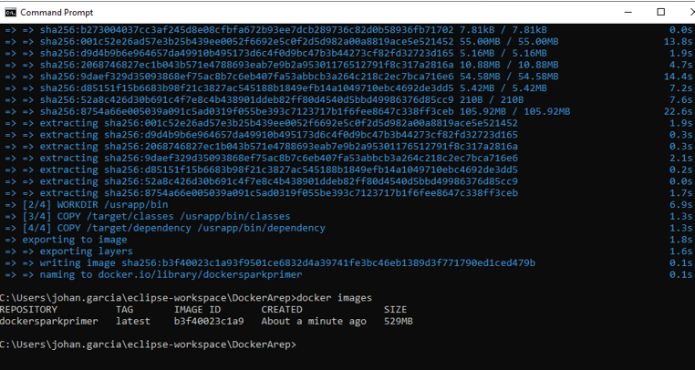
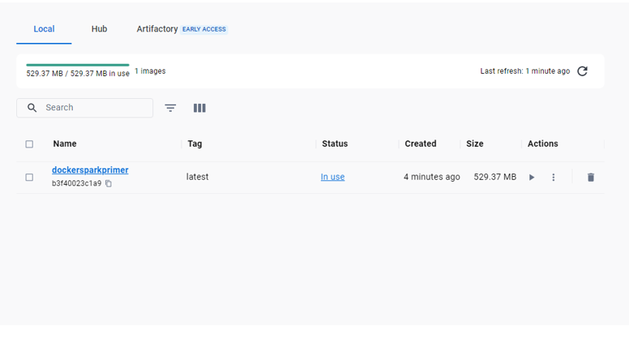

<em> # Docker Virtualization</em>

---

## Johan Sebastian Garcia Martinez

---

### Requerimientos para la implementación del laboratorio completo

- Maven
- Java
- Spark
- Docker

--- 

### Funcionalidades

El objetivo principal de este proyecto es realizar una pequeña aplicación web basada en el micro-framework Spark en la que se puedan hacer llamados a 4 funciones distintas las cuales son sen(value) la cual calcula el Seno del valor ingresado, cos(value) el cual ccalcula el coseno del valor ingresado, pali(value) el cual indíca si el valor ingresado es una cadena palindroma, mag(x,y) el cual indica la magnitud del vector de dos dimensiones x y y, Las cuales son solicitadas por medio de REST al servidor.
Despues de esto procedemos a construir y configurar un contenedor en Docker con su respectiva imagen e instancias para la aplicación creada anteriormente, este repositorio se subirá al dockerHub luego de crear un perfil de usuario.

---

### Obtener el código del proyecto
Debemos clonar el repositorio a la máquina local con el siguiente comando:
`git clone https://github.com/JohanSGarciaM/dockerhubrp.git`

### Ubicar el proyecto
Nos ubicamos en la carpeta /dockerhubrp 
`cd dockerhubrp`

### Compilar el proyecto
Ahora compilamos el proyecto para que se generen los archivos de clase correspondientes con el siguiente comando:
`mvn clean install`

### Ejecutar el proyecto apuntando al servicio principal
En la misma dirección ejecutamos el siguiente código para arrancar la aplicación:
`java -cp "target/classes;target/dependency/*" co.edu.escuelaing.sparkdockerdemolive.SparkWebServer`

---

Una vez el servidor se encuentre activado nos dirigimos al navegador y solicitamos a la dirección y puerto especificados:

Debemos indicar la operación dentro de la URL y los parámetros  como se indíca en las funcionalidades del proyecto descritas anteriormente
`localhost:4567/index`

---

En caso de descargar la imagen de dockerhub, se debe utilizar el siguiente comando
`docker pull johansgarciam/firstdockerspark:latest`

despues debemos crear y correr el contenedor con los puertos correspondientes 

`docker run -d -p 34000:46000 --name container johansgarciam/firstdockerspark`

ahora una vez corriendo el contenedor, en el browser buscamos la dirección estipulada para el servicio

`localhost:34000/index`

Como indica la respuesta del index, utilizamos los servicios de la aplicación directamente desde los parámetros de la dirección URI

### Seno(x)

`URL sintáxis =  localhost:4567/sen?value="valor"`

Donde "valor" debe ser sustituido por la constante a la cual se le desea hallar el valor de seno

### Coseno(x)

`URL Sintáxis = localhost:4567/cos?value="valor"`

Donde "valor" debe ser sustituido por la constante a la cual se le desea hallar el valor de coseno

### Magnitud(x,y)

`URL Sintáxis = localhost:4567/mag?x="num1"&y="num2"`

Donde "num1" va a tomar el valor de x como magnitud del primer vector y "num2" va a tomar el valor de y como magnitud del segundo vector y el resultado es la mágnitud de la resultante

### Palindromo(x)

`URL Sintáxis = localhost:4567/pal?value="valor"`

Donde "valor" debe ser sustituido por la cadena a la cual se desea comprobar si es palíndroma

### No palíndromo

### Palíndromo

---

Luego de realizar la aplicación se crea una imagen en docker y se publica en dockerHub para garantizar su disponibilidad

### Creación de la imagen:

### Publicación a Dockerhub

### Link a docker:

[Johan's DockerHub](https://hub.docker.com/repository/docker/johansgarciam/firstdockerspark/general)

